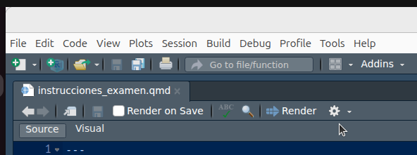
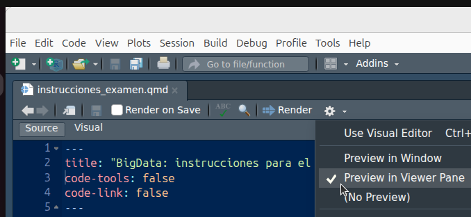

```{r, echo = FALSE}
#- para decidir si mostrar o no las respuestas
mostrar_si <- TRUE
mostrar_no <- FALSE
```

```{r chunk_setup, include = FALSE}
knitr::opts_chunk$set(echo = TRUE, eval = TRUE, message = FALSE, warning = FALSE, 
                      cache = FALSE, cache.path = "/caches/", comment = "#>",
                      #fig.width = 7, fig.height= 7,   
                      #out.width = 7, out.height = 7,
                      collapse = TRUE,  fig.show = "hold",
                      fig.asp = 7/9, out.width = "75%", fig.align = "center")
```

```{r options_setup, echo = FALSE}
options(scipen = 999) #- para quitar la notación científica
```

```{r, echo = FALSE}
library(knitr)
library(here)
library(tidyverse)
```


<style> div.blue { background-color:lightblue; border-radius: 5px; padding: 20px;} </style> <div class = "blue">

[**Instrucciones generales**]{.underline}

- El examen será el jueves 8 de enero a las 11:00 en el aula S312

- Evidentemente traeros el portatil y el cargador

- La duración del examen será de 2 horas.

- Se valorará principalmente la resolución correcta de las tareas pero, también se valorará la claridad y limpieza del código, así como la organización de los ficheros dentro del Qproject: el código tiene que entenderse. Para ello puedes incorporar todos los comentarios que creas oportunos.
</div>

<br>

<style> div.pink { background-color:pink; border-radius: 5px; padding: 20px;} </style> <div class = "pink">

**Atención !!!**

- Durante el examen se podrán utilizar apuntes y archivos de tu ordenador (pdf's, scripts, qmd's  etc...), **PERO** [no se permite conexión a Internet]{.underline}; por lo tanto, al principio del examen os pediré que apaguéis el wifi de vuestro portátil.

- Además, durante las dos horas del examen, **NO SE PERMITE ABRIR NINGÚN NAVEGADOR** (Chrome, safari, Firefox, etc..., etc...), ni obviamente ninguna aplicación de correo o de redes sociales.

- Para asegurarte que al procesar el examen NO se te abra el navegador, asegúrate de que tienes configurado RStudio para que al hacer el RENDER a tu `.qmd` con tus respuestas al examen, el resultado se visualice en la  "Viewer Pane" y no se te abra el navegador. Para ello has de: 

:::: {.columns}
::: {.column width="5%"}
:::
::: {.column width="40%"}
1) Pinchar en las opciones  de renderizado (el icono con la rueda dentada)

:::
::: {.column width="10%"}
:::
::: {.column width="40%"}
2) seleccionar la opción "Preview in Viewer Pane"

:::
::: {.column width="5%"}
:::
:::

<br>

</div>


<br>


<style> div.pink { background-color:pink; border-radius: 5px; padding: 20px;} </style> <div class = "pink">

**Para evitar las tentaciones de copiar:**

- Al finalizar el examen (o durante este) el profesor podrá solicitar el acceso a la Terminal de vuestro portátil para ver que programas (y navegadores) habéis usado durante el examen.

</div>


<br><br>

<style> div.antique {background-color:antiquewhite; border-radius: 5px; padding: 20px;} </style> <div class = "antique">

[**Instrucciones para la realización y entrega del examen**]{.underline}

1. Para entregar tus respuestas [crea un Quarto project]{.underline} con el siguiente nombre: **examen_primer-apellido_primer-nombre_NPA**. Por ejemplo: `examen_perez_pedro_HQ696792`. Fíjate que hay 3 guiones bajos y que **todo va en minúsculas** (excepto el NPA) y que no hay tildes ni otras marcas de puntuación.


2. Debes entregar tus respuestas a las preguntas del examen creando, dentro del Qproject, un documento  `.qmd` llamado: **respuestas_primer-apellido_primer-nombre_NPA.qmd**. Por ejemplo: `respuestas_perez_pedro_HQ696792.qmd`. (Fíjate que hay 3 guiones bajos ... ). En el YAML de este archivo debe figurar como mínimo tu nombre completo y la fecha de renderizado del examen


3. Asimismo, tienes que entregar (dentro del Qproject) el archivo  **respuestas_primer-apellido_primer-nombre_NPA.html**, resultado de hacer "Render" en el archivo .qmd anterior. En mi caso el archivo se llamaría `respuestas_perez_pedro_HQ696792.html`.


4. No borres el archivo `_quarto.yml` del Qproject; de hecho, se valorará positivamente que las opciones de chunks y de procesado genérico del Qproject se especifiquen en el archivo `_quarto.yml` en lugar de en el qmd con las respuestas al examen.

5. En el Qproject has de crear una carpeta llamada "datos" donde se almacenarán los ficheros de datos que te haré llegar por mail (a tu mail de la UV) media hora antes del examen. 

5. Al finalizar el examen deberás comprimir en un archivo `zip` tu proyecto y hacérselo llegar al profesor como éste indique en el aula. Es decir, al finalizar el examen tienes que entregar **un único fichero .zip con tu Qproject**. Obviamente, el fichero .zip en mi caso se llamaría: `examen_perez_pedro_HQ696792.zip` 

6. El fichero .zip que me envíes debe contener todo tu proyecto; es decir, entre otras cosas debe contener los datos, el fichero `_quarto.yml`, el fichero .qmd con las respuestas al examen y el fichero .html ya procesado, vamos, **TODO el proyecto**.

7. Recuerda que el fichero .html debe ser legible; es decir, en cada pregunta se debe mostrar el código con las instrucciones de R necesarias para contestarla y debe mostrase también el output demandado, ya sea este un mapa, una tabla, etc ... 

8. Recuerda que se valora principalmente la resolución correcta de las tareas, pero también la claridad del código de los scripts y la organización de los ficheros dentro del Rproject.

9. También se valorará que, cuando yo abra tu Qproject, el fichero .qmd pueda ser procesado directamente sin errores, así como que la presentación de los resultados en el documento .html sea clara. Por ejemplo, se valorará negativamente la presencia de warnings o mensajes de R en el documento .html. Por ejemplo se **valorará positivamente la presencia de un índice flotante en el fichero .html**, ya que esto facilita la lectura y corrección del examen. Asimismo, se valorará positivamente que se pueda copiar en el portapapeles (pinchando en un icono) el código de los chunks. 

10. Cuando yo corra vuestro código para evaluaros no tiene que mostrarse nada más que las respuestas a las preguntas. No se me debe abrir ninguna ventana (por ejemplo con `View(df)`) ni tenéis que hacerme instalar ningún paquete. Por ejemplo, si necesitaseis instalar algún paquete, antes de entregar el examen, comentáis esa linea de código.

11. Antes de comenzar el examen se resolverán todas las dudas referentes a la presentación y formato de este.

</div>


<br><br>


<style> div.antique { background-color:antiquewhite; border-radius: 5px; padding: 20px;} </style> <div class = "antique">

**Formato del documento .html con tus respuestas**

1. El fichero .html (generado con el .qmd) debe tener un índice flotante similar al utilizado en los tutoriales de clase. Además el fichero .html debe contener un botón que permita descargar el fichero `.qmd` que ha generado el fichero `.html` que contiene tus respuestas.

2. El examen tiene 4 partes o secciones. Cada una de las 4 secciones del examen comenzará con un título de primer nivel. 

3. Si una sección del examen tuviese varios apartados, se ha de separar cada apartado con un título de **tercer nivel**. 

4. El titulo del documento .qmd debe ser "Programación y manejo de datos (Respuestas al examen final)" y en el campo autor debe figurar tu Nombre y Apellidos. También debe aparecer la fechaa de procesado del `.qmd`

5. **No se deben copiar ni las instrucciones, ni los enunciados de las preguntas** pero, si quieres, puedes escribir en el texto y en el código del .qmd los comentarios que consideres oportunos.

6. La mejor forma de ver cómo ha de quedar vuestro documento .html es ver **un ejemplo**. Lo tenéis  [**aquí**](https://perezp44.github.io/intro-ds-25-26-web/mas-cosas/ex_final_BigData_24-25_sin-soluciones-bones.html){target="_blank"}. 


</div>


<br><br>

<style> div.blue { background-color:lightblue; border-radius: 5px; padding: 20px;} </style> <div class = "blue">

**PUNTUACIÓN:**


- El examen constará de entre 3 y 5 preguntas con varios apartados. En total habrán 20 apartados (aproximadamente)

- Cada apartado aportará un punto.

- Recuerda que factores como la estructura y limpieza del código o el ajustarse a estas instrucciones también se valoran; por lo que, la puntuación máxima del examen puede llegar a 25 puntos.


</div>


